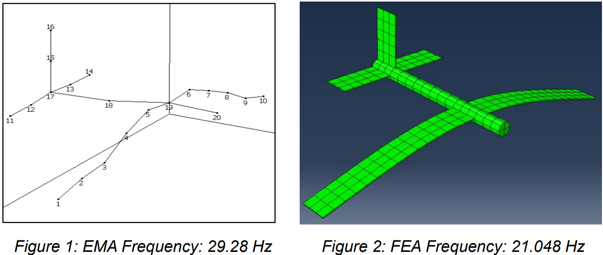
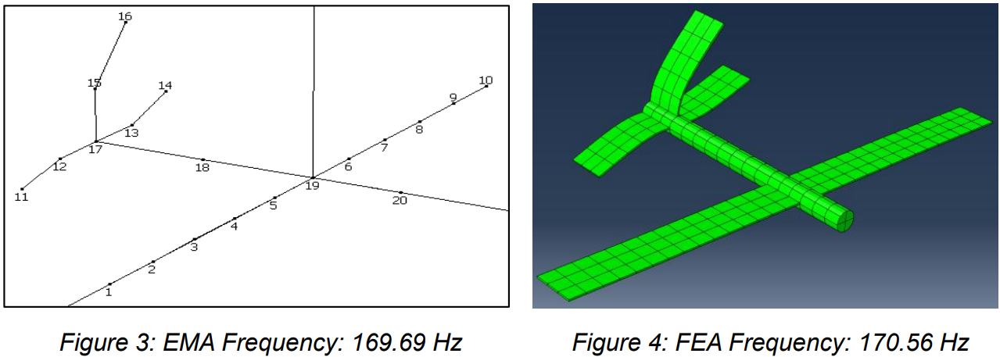

## 프로젝트 개요

- **프로젝트:** 항공기 구조물의 진동 모달 해석 및 실험·해석 비교
- **수행 기간:** 2024년 3월 ~ 2024년 4월
- **소속:** 영국 글래스고대학교 기계공학과
- **과제 유형:** 기계공학 4학년 진동(Vibration) 과제

## 문제 정의

- 항공기 구조물의 동적 특성을 정확히 평가하려면 **고유진동수, 모드 형상 및 공진 특성**을 파악해야 함.
- 실험 모달 해석(EMA)은 실제 구조물의 감쇠, 경계조건 및 제작 오차를 반영하지만, 측정 위치와 센서 조건에 영향을 받음.
- 유한요소해석(FEA)은 구조 거동을 예측할 수 있으나, 이상화된 재료, 형상, 경계조건 및 메쉬 설정으로 인해 실제 실험과 차이가 발생할 수 있음.
- 따라서 EMA와 FEA 결과를 직접 비교하여 **차이의 원인과 각 해석 방법의 한계**를 검토할 필요가 있음.

## 과제 목표

- Shaker, Force Transducer와 가속도계를 이용해 항공기 구조물의 **실험 모달 해석(EMA)** 수행
- Abaqus를 활용해 항공기 구조물의 **3D FEA 모델 구축**
- **자유진동 해석(Free Vibration)**을 통해 고유진동수와 모드 형상 추출 및 비교
- **강제진동 해석(Forced Vibration)**을 통해 주파수별 응답 및 FRF 분석 및 비교
- 날개상의 **10개 측정 지점**에서 FRF를 추출하고, 측정 위치에 따른 진동 응답 비교
- EMA의 **Modal Peaks Function(MPF)**을 이용해 주요 공진 주파수를 식별하고 FEA 결과와 비교
- EMA와 FEA의 **고유진동수, 모드 형상 및 FRF 차이**를 분석하고 모델링 한계 및 개선 방향 검토

- **고유진동수 및 모드 형상 비교:** EMA 실험 결과와 Abaqus 자유진동 해석 결과를 비교하여 주요 고유진동수와 모드 형상을 분석

  

  

